# C# All Practicals
## Practical-01 
### Calculator
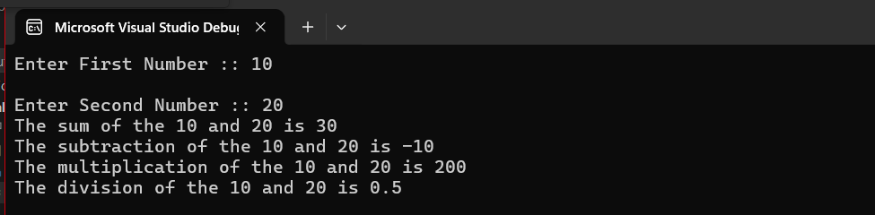

### Debugging Application
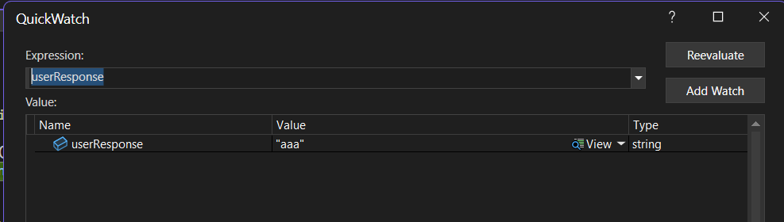

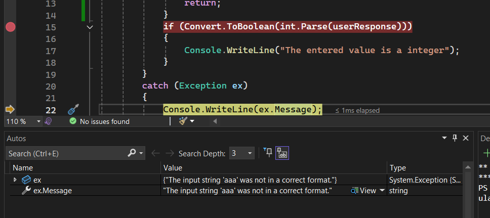

## Practical-02
### CustomerAccount
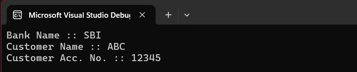

## Practical-03
### Inheritance
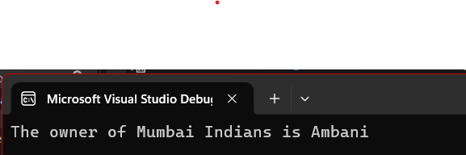

### Polymorphism
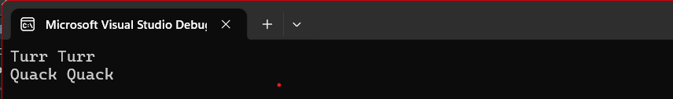

### Abstraction
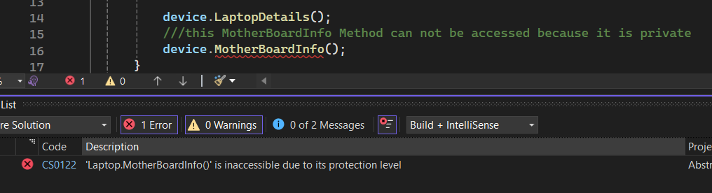

## Practical-04
### Looping, Switch and Static
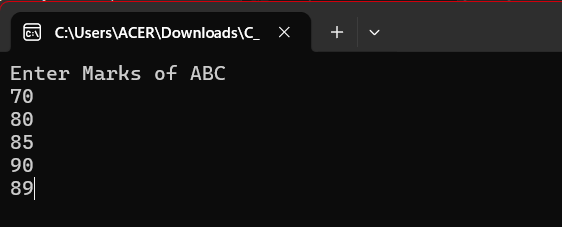
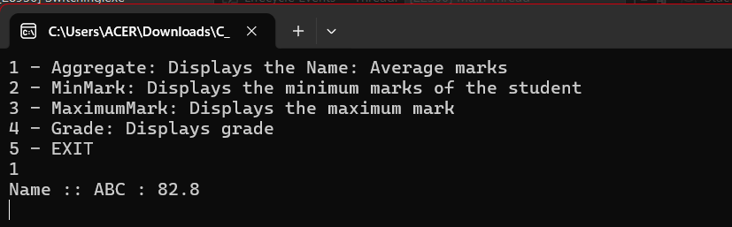
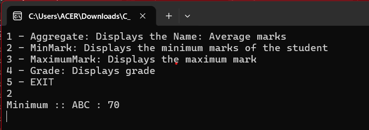
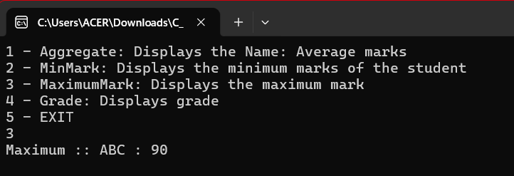
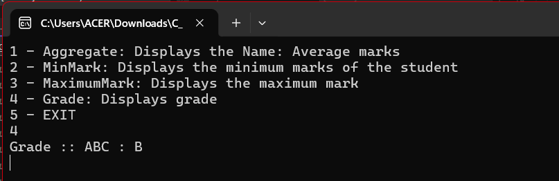

## Practical-05
### Exception handling
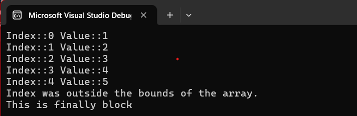

## Practical-06
### Events handling
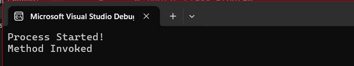

## Practical-07
### Single Responsibility Principle
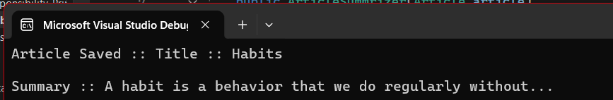

### Open Closed Principle
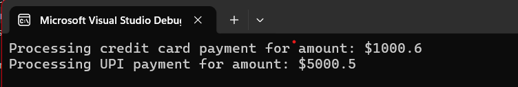

### Liskov's Substitution Principle
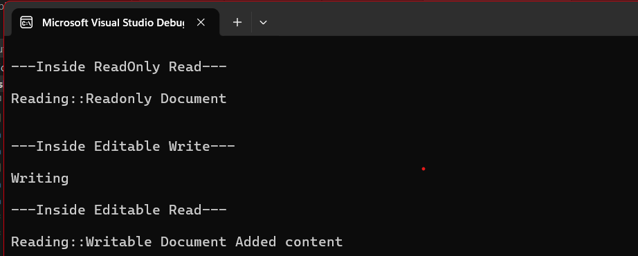

### Interface Segregation Principle

### Dependency Inversion Principle
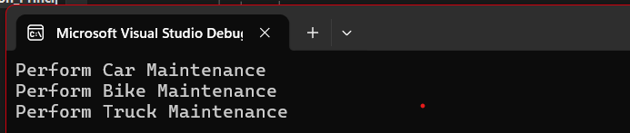

## Practical-08
### OOPs
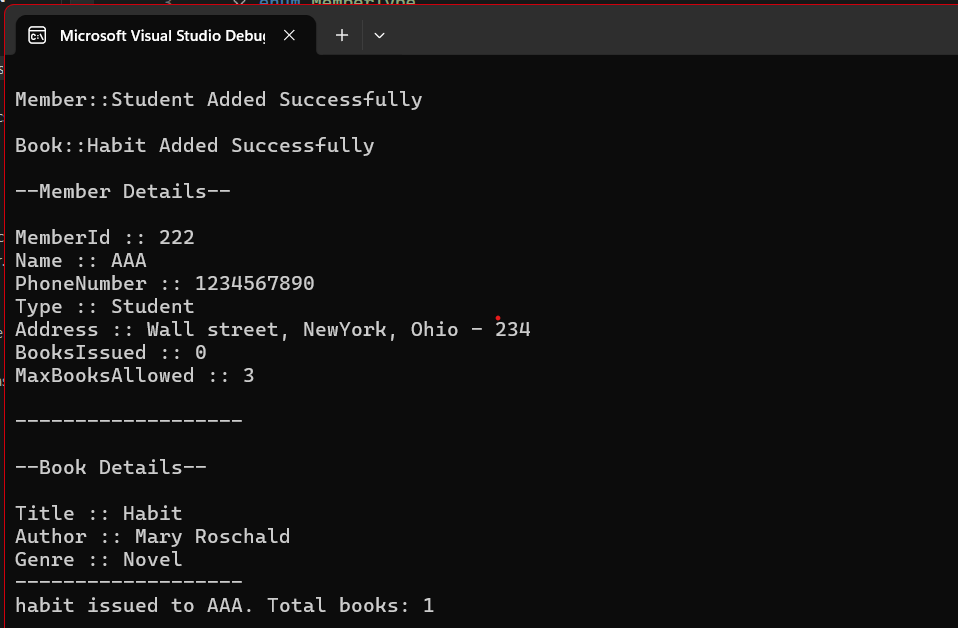
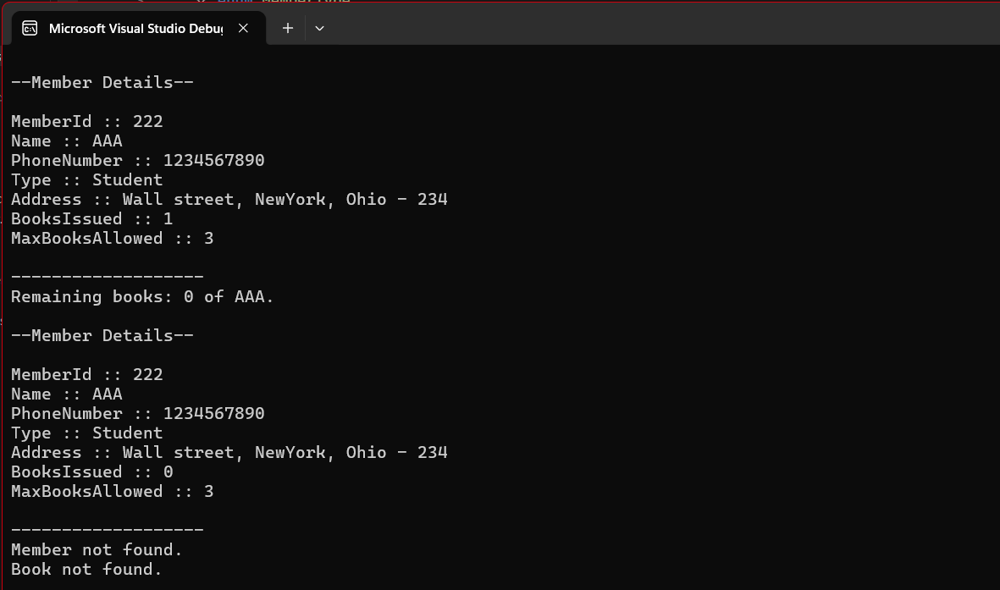

